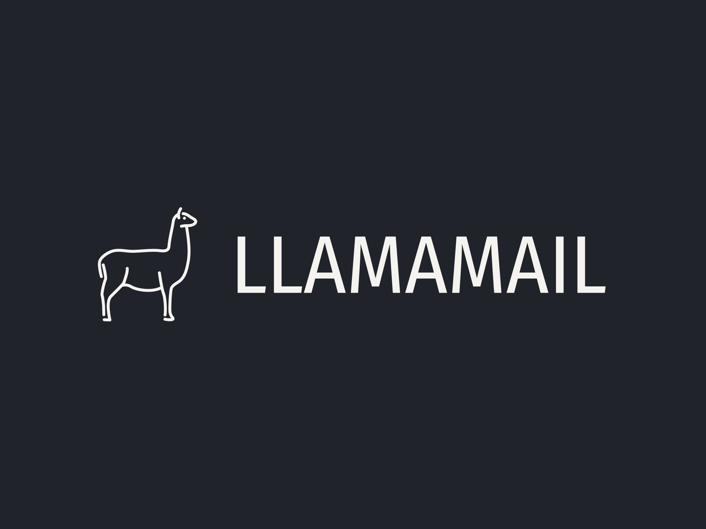

# LlamaMail - Cold Email Generator

Are you tired of sending countless cold emails to recruiters, each different based on the job description, hoping for a response? Well, those days are over!

Introducing my latest project, **LlamaMail** – your solution for generating cold emails in seconds! Developed using Meta’s cutting-edge **Llama 3.1** and **LangChain**, the tool begins by scraping job descriptions from the provided URLs. I then integrated the **Chroma** vector database for efficient storage and retrieval of my dummy portfolio details from a CSV file. Finally, I streamlined the cold email generation process with rapid output via **Groq** on **Streamlit**, achieving impressive email generation times of under 2 seconds!

With **LlamaMail**, you can focus on what truly matters – landing that dream job!

## Features
- **Job Description Scraping**: Automatically extracts job descriptions from URLs.
- **Personalized Email Generation**: Leverages Llama 3.1 and LangChain to generate customized emails based on the job description and your portfolio.
- **Efficient Data Management**: Stores and retrieves portfolio details using Chroma vector database from CSV files.
- **Fast Email Generation**: Achieves email generation in under 2 seconds by leveraging Groq and Streamlit.
- **Interactive UI**: Built with Streamlit for an intuitive user interface to interact with the generator.

## Technologies Used
- **Meta’s Llama 3.1**: Used for generating personalized email text based on job descriptions.
- **LangChain**: Helps in integrating various language model pipelines and workflows.
- **Chroma**: A vector database used to store and retrieve portfolio data from CSV files.
- **Groq**: Ensures high performance and low latency for email generation under 2 seconds.
- **Streamlit**: Provides a simple and effective interface to interact with the Cold Email Generator.

## Installation
To run LlamaMail locally, follow these steps:

### Prerequisites
- Python 3.x
- Streamlit
- LangChain
- Meta's Llama 3.1 model
- Chroma

### Clone the repository
```bash
git clone https://github.com/yourusername/LlamaMail.git
cd LlamaMail
